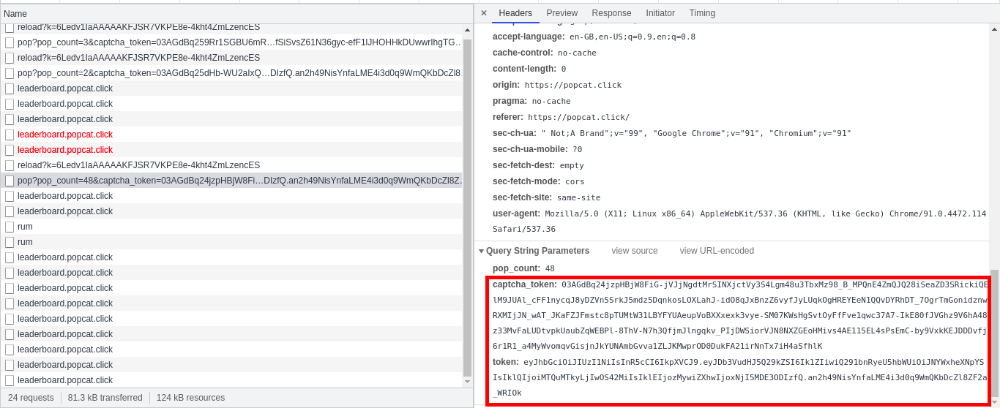

# PopCat Bot
```
Popcat for lazy people
```

## Requirements
- Python 2 / 3
- pip 

## Instal
```
pip install requests
git clone https://github.com/Hong5489/popcatbot.git
```
## How to Use
1. Goto https://popcat.click/
2. Right Click > Inspect
3. Open Network Tab
4. Popcat few times
5. Network tab will appear a request URL (https://stats.popcat.click/pop)
6. Scroll down and copy the `captcha_token` and `token` value like the image below:

  

7. Replace `captcha_token` and `token` in the `popcat.py` script
8. Run the script by command `python popcat.py` or `python3 popcat.py`
9. Enjoy =)